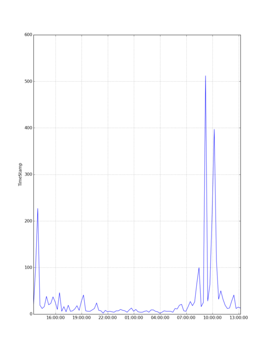

plotTimeStamps
==============

visualize time based json data

Dependencies
------------

```bash
pip install numpy
pip install matplotlib
``` 

Parameter
---------
```
usage: plotTimeStamps [-h] [-o FILENAME] [-f FIELD] [-b BUCKETS]

plot time based json data. reads default data from stdin.

optional arguments:
  -h, --help            show this help message and exit
  -o FILENAME, --fileName FILENAME
                            choose file containing bson data. (default: -)
  -f FIELD, --field FIELD
                            bsonfield with time data (default: TimeStamp)
  -b BUCKETS, --buckets BUCKETS
                            bucket count. default 24. Choose the number of
                            measurement points. (default: 24)
```

### Example

```bash
cat exampleData.bson | plotTimeStamps -b 96
```

```bash
plotTimeStamps -b 96 -f exampleData.bson
```

The result will be



Contact
-------

Jan Frederik Hake, <jan_hake@gmx.de>. [@enter_haken](https://twitter.com/enter_haken) on Twitter.
